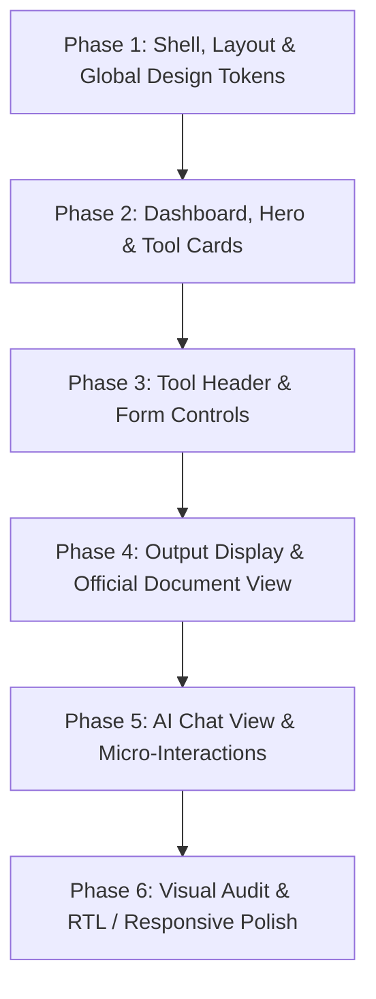

# Al Manhal Teacher Toolkit: Full UI/UX Enhancement Plan

## Goal
Elevate the visual design, polish, micro-interactions, and aesthetics of the entire Al Manhal AI Teacher Toolkit to a modern educational SaaS standard without altering the existing component hierarchy, routes, or functional structure.

---

## Design Vision & Guiding Principles
- **Al Manhal Identity**: Anchor all visual hierarchy around the official brand colors:
  - **Midnight Navy (`#1E255E`)**: Primary titles, deep cards, high-contrast badges.
  - **Royal Blue (`#2B508F`)**: Interactive primary buttons, active tabs, glowing indicators.
  - **Ocean Steel (`#4378A0`)**: Secondary accents, progress rings, delicate gradient stops.
  - **Sky Cyan (`#72A2B8`)**: Ambient glows, subtle highlights, metadata tags.
  - **Ice Soft Tint (`#F0F6FA`)**: Card surface tints, input backgrounds, soft hover fills.
- **Structural Integrity**: Keep all JSX element hierarchy, prop signatures, and routes untouched. Enhance via Tailwind CSS classes, inline design tokens, and Framer Motion spring parameters.
- **Bilingual Symmetry**: 100% harmonious RTL (Arabic) and LTR (English) rendering with correct optical alignment, font weights, and icon rotations.

---

## Component-by-Component Enhancement Breakdown

### 1. App Shell & Background Layer
- **Files**: `src/app/layout.tsx`, `src/components/PremiumBackground.tsx`, `src/app/globals.css`
- **Current State**: Static white/slate background with basic animated gradient circles.
- **Enhancements**:
  - Add layered glassmorphism with subtle SVG noise texture (`opacity-[0.025]`) to eliminate visual banding.
  - Implement radial mesh lighting that dynamically blends Al Manhal Royal Blue (`#2B508F`) and Ocean Steel (`#4378A0`).
  - Upgrade scrollbar styling with slim, smooth pill sliders (`scrollbar-thin scrollbar-thumb-blue-200 hover:scrollbar-thumb-blue-400`).
  - Refine text selection highlighting (`selection:bg-blue-100 selection:text-[#1E255E]`).
- **Verification**: Smooth scrolling across long pages without layout shifts or GPU jitter; ambient glows visible on large desktop viewports.

---

### 2. Desktop Sidebar & Navigation
- **Files**: `src/components/Sidebar.tsx`, `src/components/SidebarContent.tsx`
- **Current State**: Clean standard card sidebar with border and links.
- **Enhancements**:
  - **School Header**: Add a subtle frosted glass container around the Al Manhal logo with a delicate inner shadow (`shadow-inner ring-1 ring-black/5`).
  - **Active State Indicator**: Replace standard flat active backgrounds with a high-contrast pill containing an animated left/right indicator bar (mirrored in RTL) and subtle elevation (`shadow-md shadow-blue-900/10`).
  - **Category Headers**: Upgrade category label typography to micro-caps (`text-[10px] font-black uppercase tracking-[0.25em] text-zinc-400`).
  - **AI Chat Shortcut Button**: Upgrade from simple card to a luminous gradient card with an ambient pulse ring and metallic icon accent.
  - **Language & Preferences Toggle**: Polish the language switcher pill with smooth slide animation when toggling between Arabic (العربية) and English.
  - **Quick Tip Widget**: Refine with an academic parchment tint (`bg-gradient-to-br from-blue-50/50 to-indigo-50/30`) and a micro lightbulb icon with a gentle glow.
- **Verification**: Hovering over menu items displays fluid background transitions; active route clearly distinct; language toggle animates cleanly in both RTL and LTR.

---

### 3. Mobile Navigation & Floating Bottom Bar
- **Files**: `src/components/MobileNav.tsx`, `src/components/BottomNav.tsx`
- **Current State**: Functional mobile drawer and bottom bar.
- **Enhancements**:
  - **Mobile Header**: Add backdrop blur (`backdrop-blur-md bg-white/90`) so content scrolling underneath creates depth; add fine bottom border (`border-b border-zinc-100`).
  - **Drawer Transition**: Soften the spring physics (`damping: 28, stiffness: 220`) for a buttery slide-in feel.
  - **Bottom Bar**: Transform into a floating dock (`bottom-4 inset-x-4 max-w-md mx-auto rounded-3xl backdrop-blur-xl bg-white/95 border border-white/50 shadow-2xl shadow-blue-950/15`).
  - **Active Tab Dot**: Add a spring-animated micro-pill dot underneath the active navigation icon.
- **Verification**: Test on 375px (iPhone) and 768px (iPad) viewports. Header sticks smoothly; bottom bar doesn't obscure content.

---

### 4. Dashboard & Hero Section
- **Files**: `src/app/page.tsx`, `src/components/ui/HeroText.tsx`
- **Current State**: Hero title, category sections, and cards in standard grid.
- **Enhancements**:
  - **Hero Title ([`HeroText.tsx`](file:///e:/personal/Mesk%20AI%20Teacher%20Toolkit%20-%20Copy/src/components/ui/HeroText.tsx))**: Refine text gradient (`bg-gradient-to-r from-[#1E255E] via-[#2B508F] to-[#4378A0]`) with improved drop shadow to maximize legibility against white and light backgrounds.
  - **"Ready to Teach" Pill**: Elevate with a double-ring glowing beacon effect and animated shimmer on hover.
  - **Section Dividers**: Replace harsh borders with elegant gradient divider lines (`bg-gradient-to-r from-blue-200 via-blue-100 to-transparent`).
  - **Category Badges**: Give each section icon (Rocket, Sparkles, BookOpen, ClipboardCheck) an elevated soft squircle (`rounded-2xl shadow-sm border border-black/5`) with subtle tilt on hover.
  - **3-Step Onboarding Steps**: Upgrade cards with numbered gradient badges (`01`, `02`, `03`) and subtle hover lift (`hover:-translate-y-1 hover:shadow-xl`).
- **Verification**: Visual hierarchy leads the teacher's eye naturally from header to the tool categories.

---

### 5. Interactive Tool Cards
- **Files**: `src/components/ToolCard.tsx`
- **Current State**: 3D tilt card with color themes and spotlight.
- **Enhancements**:
  - **Border & Surface Depth**: Add layered dual-border aesthetic (`border-2 border-zinc-100 group-hover:border-[#2B508F]/40 shadow-sm group-hover:shadow-2xl group-hover:shadow-blue-900/10`).
  - **Icon Pocket**: Polish the icon container with refined squircle corners, delicate inner bevel, and a glowing orbital ring that expands on hover.
  - **Spotlight Lighting**: Tighten the radial gradient spotlight cursor tracker to look like soft studio illumination rather than a harsh circle.
  - **Typography & Truncation**: Balance title weight (`font-black tracking-tight text-zinc-900`) and description leading (`leading-relaxed text-zinc-500 line-clamp-2`).
  - **Action Arrow Button**: Enhance the bottom-corner arrow button with a spring rotation and color inversion on card hover.
- **Verification**: Hovering over cards feels physical, tactile, and smooth (60fps); text stays crisp in both English and Arabic.

---

### 6. Tool Page Header & Breadcrumbs
- **Files**: `src/components/ToolHeader.tsx`
- **Current State**: Breadcrumb list and large header card.
- **Enhancements**:
  - **Breadcrumbs**: Polish chevron alignment, subtle hover underline/color change, and add a soft pill badge for the current active tool.
  - **Main Header Card**: Add subtle textured background pattern and refined multi-stop corner flare.
  - **Large Tool Icon**: Give the 80x80px icon container a 3D glass treatment with inset highlights and rich shadow.
  - **Category Pill**: Refine with crisp micro-typography (`text-[10px] uppercase font-black tracking-widest px-3 py-1 rounded-full`).
- **Verification**: Breadcrumbs properly inverted in Arabic (`rotate-180` on chevrons); icon matches category identity.

---

### 7. Tool Input Form & Controls
- **Files**: `src/components/ToolForm.tsx`
- **Current State**: Standard inputs, selects, and textareas.
- **Enhancements**:
  - **Field Containers**: Upgrade inputs and textareas to modern soft-pill cards with subtle border transitions (`border-2 border-zinc-100 hover:border-zinc-200 focus:border-[#2B508F]/40 focus:ring-4 focus:ring-[#2B508F]/10`).
  - **Custom Select Arrow**: Replace default select chevron with a sleek, polished SVG arrow with transition on focus.
  - **Learning Differentiation Segmented Control**:
    - Elevate the 4 level pills (None, Support, Standard, Challenge) into an active segmented toggle with smooth sliding indicator or spring-animated active button states.
  - **Primary "Generate Content" Button**:
    - Add a subtle continuous shimmer highlight moving across the button.
    - Polish loading state with animated dual-ring spinner and typewriter/phased status messaging ("Extracting pedagogical standards...", "Synthesizing lesson plan...").
  - **Error Toast Banner**: Restyle with rounded-2xl container, soft rose tint, warning badge icon, and subtle shake animation.
- **Verification**: Filling inputs gives satisfying focus feedback; clicking Generate shows clear progress indication without UI jumping.

---

### 8. Generated Output Display & Document View
- **Files**: `src/components/OutputDisplay.tsx`
- **Current State**: Action bar, refine drawer, and document display.
- **Enhancements**:
  - **Top Action Bar**:
    - Upgrade Copy, PDF, and DOCX buttons with micro-icon animations (checkmarks, download arrows).
    - Add quick feedback tooltip when text is copied.
  - **Refinement Drawer**:
    - Polish chips ("Simpler", "More details", "Shorter", "More activities") with micro-pulsing dots and subtle hover expansion.
  - **Official Document Sheet**:
    - Recreate the look of an **Al Manhal Official Educational Document** (`rounded-[2.5rem] bg-white border border-zinc-200 shadow-2xl p-10 md:p-16`).
    - Add an official institutional header with Al Manhal logo, date stamp, teacher subject badge, and decorative watermarking.
  - **Markdown & Section Cards**:
    - Section numbers (`01`, `02`, `03`) inside sleek squircle badges.
    - Custom styled callout boxes for activities and objectives.
    - Clean typography scales for `h1`, `h2`, `h3`, with custom bullet points and blockquotes.
  - **Educational Visuals Gallery**:
    - Polish AI-generated visual cards with rounded-2xl frames, smooth zoom on hover, and dark glass caption overlays.
  - **Pedagogical Insight Footer**:
    - Restyle as an executive insight card with dark navy background (`bg-[#1E255E]`), glowing cyan accents (`text-[#72A2B8]`), and pulse badge.
- **Verification**: Document exports cleanly to PDF/DOCX; markdown formatting renders beautifully in Arabic and English.

---

### 9. AI Assistant Chat Experience
- **Files**: `src/components/ChatView.tsx`
- **Current State**: Standard two-column chat message list with input box.
- **Enhancements**:
  - **Chat Header**: Add active assistant status beacon ("Al Manhal AI • Ready to assist"), refined clear button with tooltip.
  - **Empty State**: Add quick-prompt suggestion starter chips that populate the input when clicked (e.g. "Suggest a 5-minute science hook", "Create a rubric for grade 7").
  - **Message Bubbles**:
    - User bubble: Sleek dark navy (`bg-[#1E255E] text-white shadow-md rounded-2xl rounded-tr-none`).
    - AI bubble: Clean white surface with fine border (`bg-white border border-zinc-100 shadow-sm rounded-2xl rounded-tl-none`).
  - **Streaming Dots Indicator**: Smooth wave animation in a pill bubble.
  - **Input Bar**: Elevate with subtle floating glass elevation, keyboard shortcuts hint, and responsive send button with icon rotation in RTL.
- **Verification**: Messaging flows smoothly, messages auto-scroll to bottom, markdown inside AI responses renders cleanly.

---

## Phased Execution Roadmap

| Phase | Target Components | Focus Areas | Verifiable Output |
| :--- | :--- | :--- | :--- |
| **Phase 1** | `globals.css`, `layout.tsx`, `Sidebar.tsx`, `SidebarContent.tsx`, `BottomNav.tsx`, `MobileNav.tsx` | Layout shell, sidebar glass, navigation pills, floating mobile dock | Premium navigation shell with seamless language toggle |
| **Phase 2** | `page.tsx`, `HeroText.tsx`, `ToolCard.tsx` | Hero typography, 3D card tilt & lighting, category headers | Stunning home dashboard with responsive 3D card grid |
| **Phase 3** | `ToolHeader.tsx`, `ToolForm.tsx` | Breadcrumbs, inputs, select boxes, differentiation tabs, shimmer button | High-tech interactive generator form |
| **Phase 4** | `OutputDisplay.tsx` | Institutional document header, action buttons, section cards, visual aids | Executive school document view with export readiness |
| **Phase 5** | `ChatView.tsx` | Quick starter chips, chat bubbles, streaming indicator, send controls | Fluid conversational AI tutor interface |
| **Phase 6** | Full Platform | Cross-browser testing, Arabic RTL verification, mobile responsiveness | Zero regressions, 100% build pass, verified on dev server |

---

## Success Criteria ("Done When")
- [ ] Every component adheres to the **Al Manhal International Schools** royal/navy design palette.
- [ ] No changes made to routing, API payload structure, or file directory tree.
- [ ] Visual polish feels cohesive, modern, and worthy of a top-tier institutional toolkit.
- [ ] Perfect RTL rendering in Arabic and LTR in English across all viewports.
- [ ] Dev server compiles with zero errors and passes clean visual verification.
